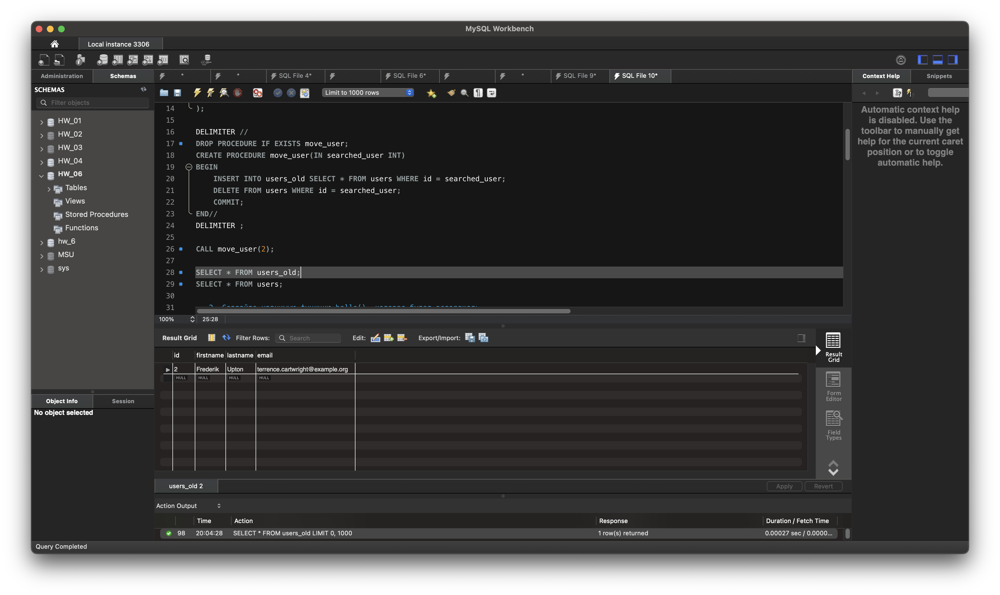
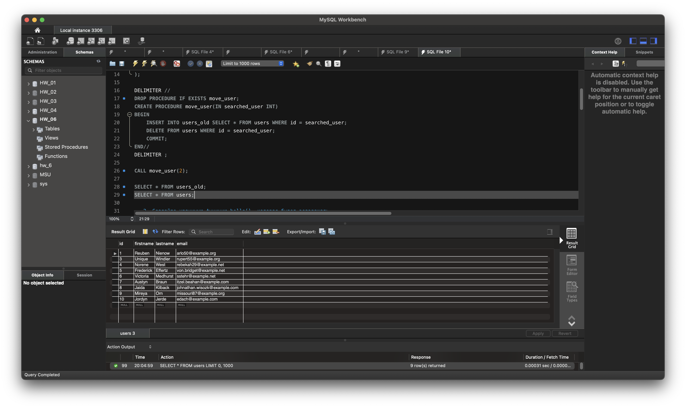
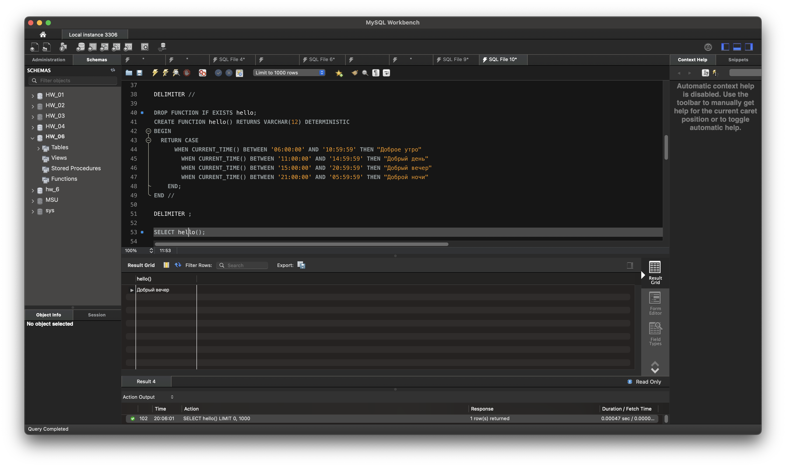
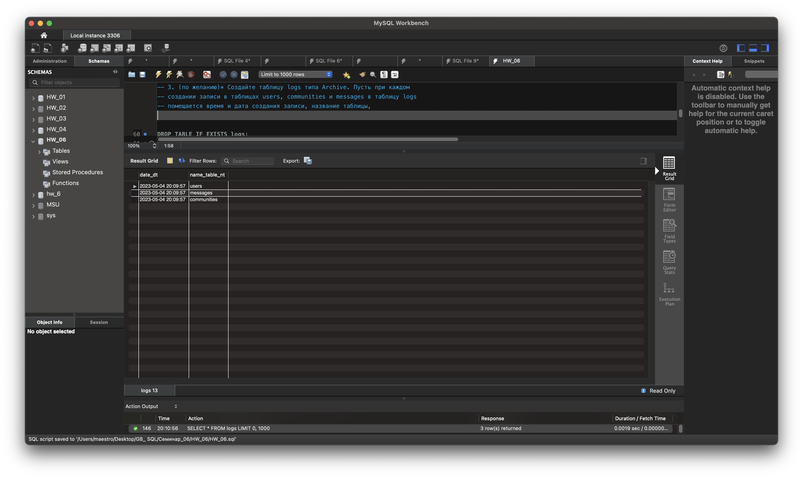

USE HW_06; 

-- 1. Создайте таблицу users_old, аналогичную таблице users. Создайте 
-- процедуру, с помощью которой можно переместить любого (одного) 
-- пользователя из таблицы users в таблицу users_old. (использование 
-- транзакции с выбором commit или rollback – обязательно). 

DROP TABLE IF EXISTS users_old; 
CREATE TABLE users_old ( 
	id SERIAL PRIMARY KEY, -- SERIAL = BIGINT UNSIGNED NOT NULL AUTO_INCREMENT UNIQUE 
    firstname VARCHAR(50), 
    lastname VARCHAR(50), 
    email VARCHAR(120) UNIQUE 
); 

DELIMITER // 
DROP PROCEDURE IF EXISTS move_user; 
CREATE PROCEDURE move_user(IN searched_user INT) 
BEGIN 
	INSERT INTO users_old SELECT * FROM users WHERE id = searched_user; 
	DELETE FROM users WHERE id = searched_user; 
	COMMIT; 
END// 
DELIMITER ; 

CALL move_user(2); 

SELECT * FROM users_old; 
SELECT * FROM users; 

-- 2. Создайте хранимую функцию hello(), которая будет возвращать 
-- приветствие, в зависимости от текущего времени суток. С 6:00 до 12:00 
-- функция должна возвращать фразу "Доброе утро", с 12:00 до 18:00  
-- функция должна возвращать фразу "Добрый день", с 18:00 до 00:00 — 
-- "Добрый вечер", с 00:00 до 6:00 — "Доброй ночи". 

DELIMITER // 

DROP FUNCTION IF EXISTS hello; 
CREATE FUNCTION hello() RETURNS VARCHAR(12) DETERMINISTIC 
BEGIN 
  RETURN CASE
      WHEN CURRENT_TIME() BETWEEN '06:00:00' AND '10:59:59' THEN "Доброе утро" 	
		WHEN CURRENT_TIME() BETWEEN '11:00:00' AND '14:59:59' THEN "Добрый день"	 
		WHEN CURRENT_TIME() BETWEEN '15:00:00' AND '20:59:59' THEN "Добрый вечер"	 
		WHEN CURRENT_TIME() BETWEEN '21:00:00' AND '05:59:59' THEN "Доброй ночи" 
    END; 
END // 

DELIMITER ; 
 
SELECT hello(); 

 
-- 3. (по желанию)* Создайте таблицу logs типа Archive. Пусть при каждом 
-- создании записи в таблицах users, communities и messages в таблицу logs 
-- помещается время и дата создания записи, название таблицы, 

DROP TABLE IF EXISTS logs; 
CREATE TABLE logs ( 
	id SERIAL PRIMARY KEY, -- SERIAL = BIGINT UNSIGNED NOT NULL AUTO_INCREMENT UNIQUE 
	timestamp DATETIME DEFAULT CURRENT_TIMESTAMP NOT NULL, 
	table_name ENUM('users', 'communities', 'messages'), 
	table_key BigInt NOT NULL, 
	CONSTRAINT UNIQUE uq_logs(timestamp, table_name, table_key)  
); 
DROP TRIGGER IF EXISTS user_log_before_insert; 
DROP TRIGGER IF EXISTS communities_log_before_insert; 
DROP TRIGGER IF EXISTS messages_log_before_insert; 
DELIMITER // 
CREATE TRIGGER user_log_before_insert AFTER INSERT ON users 
FOR EACH ROW 
BEGIN 
    INSERT INTO logs(table_name, table_key) VALUES("users", NEW.id); 
END// 
CREATE TRIGGER communities_log_before_insert AFTER INSERT ON communities 
FOR EACH ROW 
BEGIN 
    INSERT INTO logs(table_name, table_key) VALUES("communities", NEW.id); 
END// 
CREATE TRIGGER messages_log_before_insert AFTER INSERT ON messages 
FOR EACH ROW 
BEGIN 
    INSERT INTO logs(table_name, table_key) VALUES("messages", NEW.id); 
END// 
DELIMITER ; 
-- Проверка лога 
SET @num = round(rand() * 10, 0); 

INSERT INTO users (firstname, lastname, email) VALUES(CONCAT('first', @num), CONCAT('last', @num), CONCAT(@num, '@emails.ru')); 
INSERT INTO messages (from_user_id, to_user_id, body, created_at) VALUES(last_insert_id(), 10, 'test body', CURRENT_TIMESTAMP); 
INSERT INTO communities (name) VALUES(CONCAT('test', @num)); 
 
SELECT * FROM logs; 
